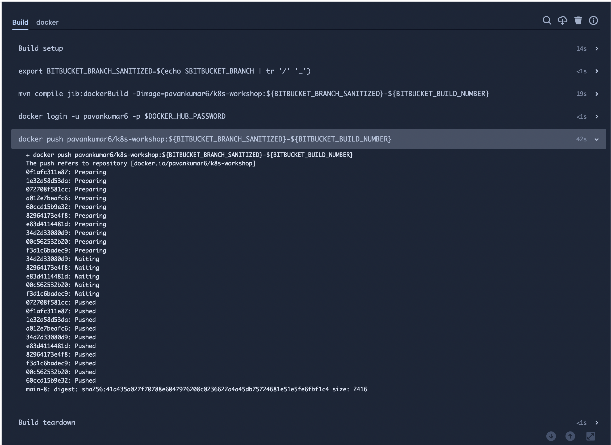

# Getting Started


### Testing Locally

```
$ mvn -Djibstep.skip=true -DskipTests clean install
$ java -jar target/workshop-0.0.1-SNAPSHOT.jar
```

### Adding a Bitbucket Pipeline
----
##### 1. Clone the repository and checkout to a **new** branch from `main`
##### 2. Add Bitbucket pipeline `bitbucket-pipelines.yml` in the root of the repository
##### 3. Commit the changes to a remote branch
##### 4. Run the pipeline - [Click Here](https://bitbucket.org/pavankumar6997/workshop/pipelines/results/page/1) -> Click `Run Pipeline` -> Select `<your branch>` -> Click `Run`
##### 5. Copy the docker image id that was built 

### Deploying the docker image in Kubernetes
----
##### 1. open the link shared with you on your desired browser
##### 2. create a namespace via kubectl
```
kubectl create namespace demo
```
##### 3. create a kubernetes pod in the `demo` namespace which holds the container image that was built in bitbucket pipeline earlier
```
kubectl run  myapp --image=<IMAGE_BUILT_ON_BITBUCKET>

